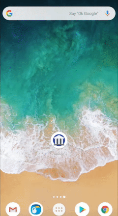
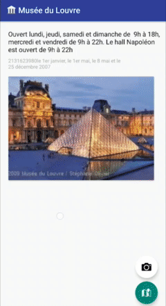

# Museo - Student Project
Visualize your favorite museums and learn more with QR codes in exhibitions.

# Documentation

## See Museums
The homepage will display your saved museums.

## Scan a museum
Tap the Scan icon to scan a Museum QR code

## See a Museum
Tap on a museum card to see more

## Add a picture
Tap on the camera icon to add a Picture to the museum

## **Bonus** : Localize a Museum
The map button shows the museum on **Google Maps** 

# Example QR Codes

Invalid Code

Valid Code
